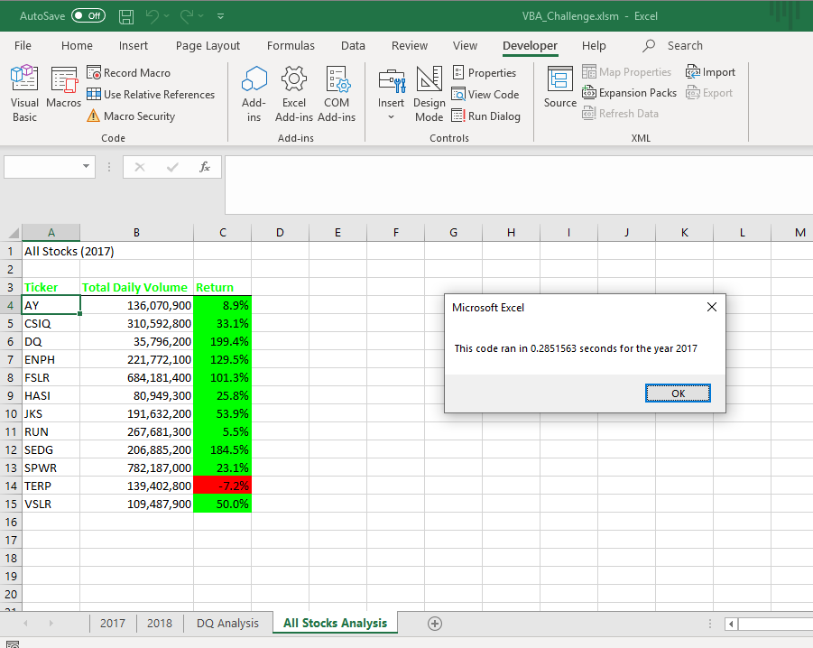
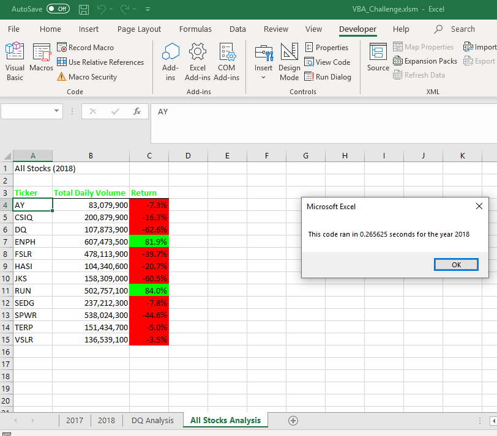

# Stock Analysis

## Project Overview

In this analysis, I refactored old code to go through our dataset to look at the entire stock market over the last few years. By running this analysis, it's easy to see the starting price, ending price, and return for a large number of stocks in each year.

## Results

### 2017 vs. 2018 Stock Performance




To calculate return I used the previously calculated tickerStartingPrices and tickerEndingPrices. Dividing the two and then subtracting one outputs a percentage return, and the code below outputs that value:

```vba
Cells(4 + t, 3).Value = Round((tickerEndingPrices(t) / tickerStartingPrices(t) - 1), 3)
``` 

In 2017, all of the stocks had a positive return, except for the stock with ticker TERP, which had a negative return. When looking at the return on stocks for 2018, you can see that ten of the twelve stocks did not do well and had a negative return. 

### Execution Time of Original and Refactored Script
As shown in the previous images, my code for 2017 ran in 0.2851563 seconds, and 2018 ran in 0.265625 seconds. The code ran almost one second faster for both 2017 and 2018 than the original, not refactored code did. While this is a small difference for our example, if you were working with millions of rows the refactored code would save a lot of time. 

## Summary
### Advantages and Disadvantages of Refactoring Code
When refactoring code you can find more efficient ways to write your code. This more efficient code may take less time to execute, which will save you time. It can also make the code more efficient and therefore easier to read, less steps to get the same result, and use less memory.


A disadvantage of reactoring code is that it can be time consuming. If you spend a lot more time refactoring code than you save by refactoring, it can be a waste of time. If not done correctly, it could create more problems or make things more complicated. 

### Pros and Cons of refactoring the original VBA script?
When refactoring the original VBA script, I made the code more efficient to save time. While original the code worked for the smaller dataset we have, if it were to run on a very large dataset it would take a lot of time and memory. One con is that it took me a long time to refactor because I'm new to VBA, and I spent a lot of time debugging errors I made. 
